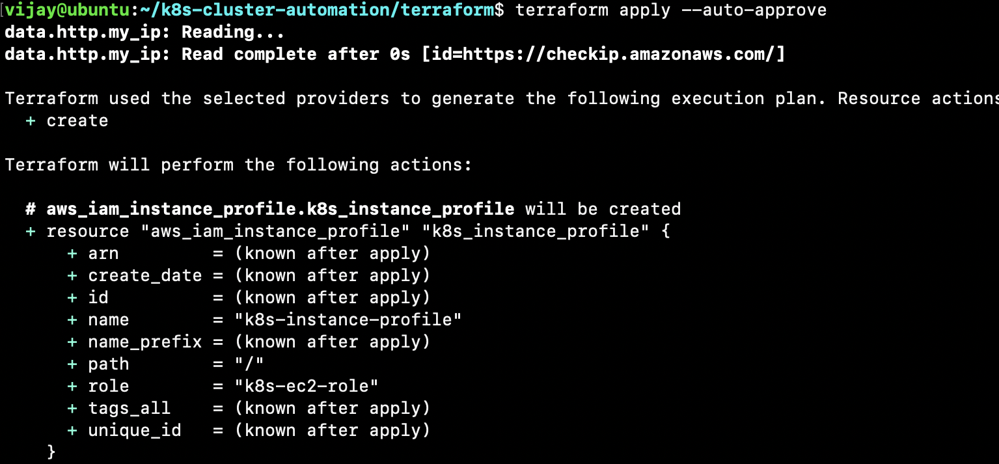
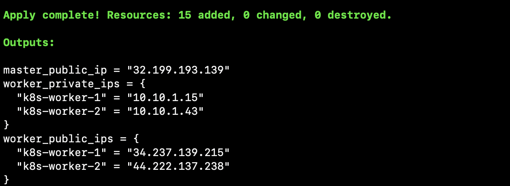
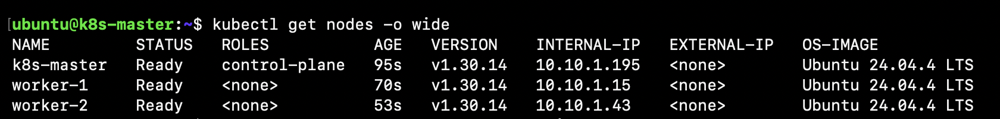
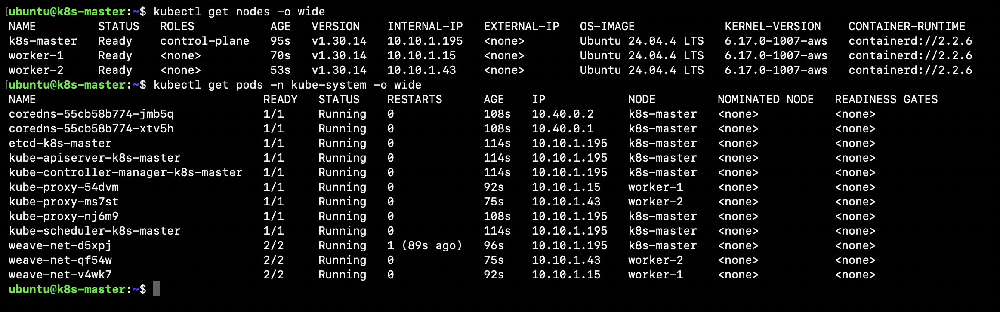
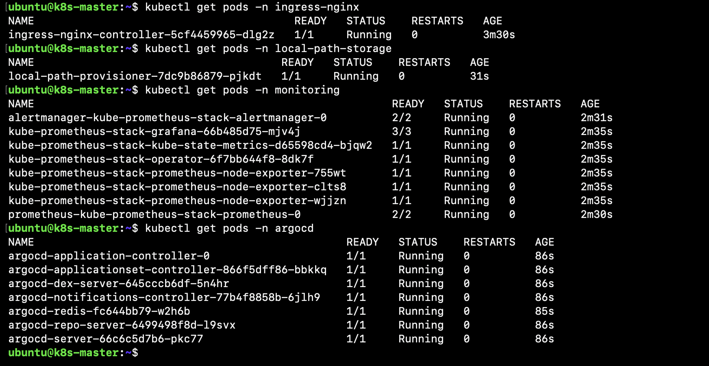
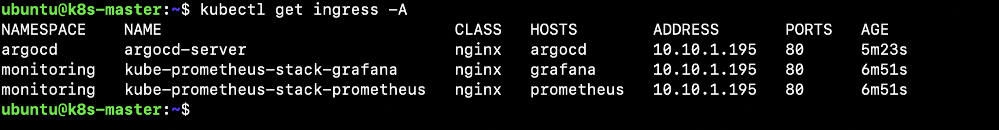
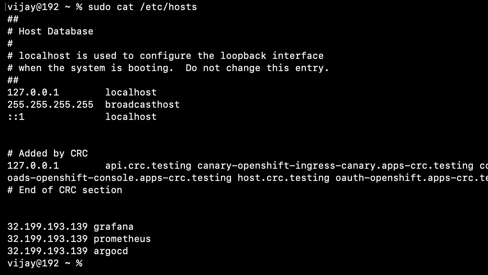
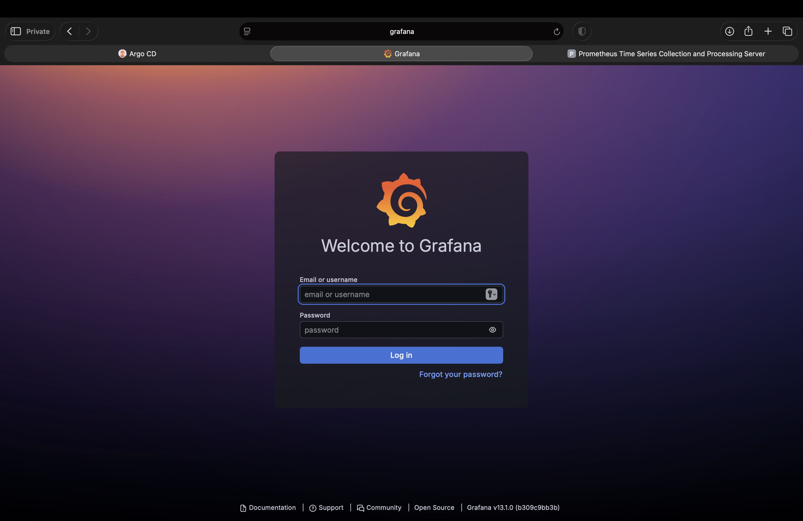
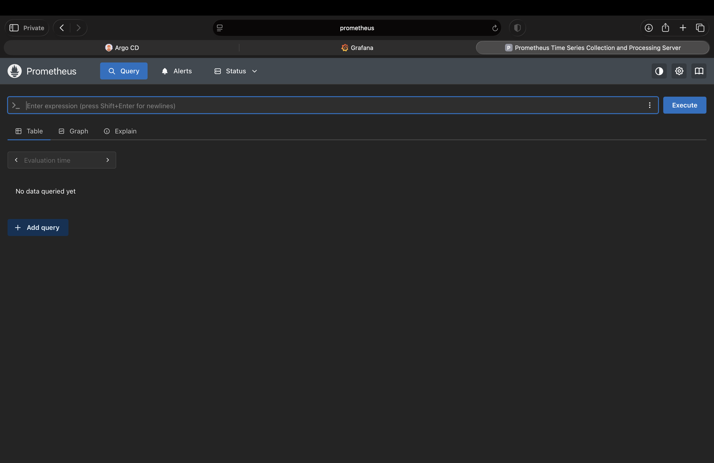

# 🚀 Kubernetes Cluster Automation

<p align="center">


</p>

<p align="center">

<strong>Production-ready Kubernetes Cluster Automation Platform on AWS</strong>

Provision a complete Kubernetes platform using <strong>Terraform</strong>, <strong>AWS</strong>, <strong>kubeadm</strong>, <strong>containerd</strong>, <strong>Helm</strong>, <strong>NGINX Ingress</strong>, <strong>Prometheus</strong>, <strong>Grafana</strong>, <strong>Argo CD</strong>, and <strong>GitOps</strong>.

</p>

---

## 🚀 Project Highlights

- ☁️ Fully Automated Kubernetes Cluster Provisioning on AWS
- 🏗️ Infrastructure as Code (Terraform)
- ⚙️ Automated Kubernetes Installation using kubeadm
- 📦 containerd Container Runtime
- 🌐 Weave Net CNI Networking
- 📂 Dynamic Persistent Storage (Local Path Provisioner)
- 🚪 NGINX Ingress Controller
- 🔐 cert-manager for TLS Certificate Management
- 📈 Prometheus Monitoring Stack
- 📊 Grafana Dashboards
- 🔄 Argo CD GitOps Platform
- 📜 Modular Installation Scripts
- 🛠️ Easy Cluster Recreation
- 📖 Comprehensive Documentation

---

## 📌 Project Status

| Property | Value |
|-----------|-------|
| Version | v1.0 |
| Status | Production Ready |
| Kubernetes | v1.30 |
| Cloud Provider | AWS |
| OS | Ubuntu 24.04 LTS |
| Runtime | containerd |
| Infrastructure | Terraform |
| Automation | Bash |
| GitOps | Argo CD |
| Monitoring | Prometheus + Grafana |
| License | MIT |

---

# 📚 Table of Contents

- [📖 Executive Summary](#-executive-summary)
- [🎯 Project Goals](#-project-goals)
- [📦 What You'll Get](#-what-youll-get)
- [✨ Key Features](#-key-features)
- [🏛️ High-Level Architecture](#-high-level-architecture)
- [📝 Architecture Overview](#-architecture-overview)
- [📦 Platform Components](#-platform-components)
- [⚙️ Automation Pipeline](#-automation-pipeline)
- [🛠️ Technology Stack](#-technology-stack)
- [📂 Repository Structure](#-repository-structure)
- [🎯 Design Principles](#-design-principles)
- [📋 Prerequisites](#-prerequisites)
- [⚙️ Project Configuration](#-project-configuration)
- [🚀 Deploy the Platform](#-deploy-the-platform)
- [✅ Verify Cluster Health](#-verify-cluster-health)
- [🌐 Access Platform Components via NGINX Ingress](#-access-platform-components-via-nginx-ingress)
- [📊 Access Platform Components](#-access-platform-components)
- [🧪 Cluster Validation Checklist](#-cluster-validation-checklist)
- [📷 Screenshots](#-screenshots)
- [🛣️ Roadmap](#-roadmap)
- [📚 Documentation](#-documentation)
- [🤝 Contributing](#-contributing)
- [📄 License](#-license)

---

# 📖 Executive Summary

Managing Kubernetes clusters manually is time-consuming, repetitive, and prone to configuration drift. Installing every component individually—including the container runtime, Kubernetes binaries, networking, ingress controller, monitoring stack, storage provisioner, and GitOps platform—requires significant effort and increases the likelihood of inconsistent environments.

This project solves that problem by providing a fully automated Kubernetes platform deployment on Amazon Web Services (AWS).

Using Infrastructure as Code (IaC) principles, Terraform provisions the required AWS infrastructure, while automated installation scripts bootstrap a production-ready Kubernetes cluster using kubeadm. Once the cluster is operational, additional platform services such as Helm, NGINX Ingress Controller, Local Path Storage Provisioner, Prometheus, Grafana, and Argo CD are installed automatically.

The final outcome is a Kubernetes platform that is immediately ready to host applications using GitOps workflows without requiring any manual installation of platform components.

Unlike many Kubernetes tutorials that focus only on cluster creation, this project automates the deployment of an entire Kubernetes platform, providing a repeatable and production-oriented foundation for cloud-native applications.

---

# 🎯 Project Goals

The primary objectives of this project are:

- Automate Kubernetes cluster provisioning on AWS
- Eliminate repetitive manual installation tasks
- Follow Infrastructure as Code (IaC) best practices
- Build a reusable production-ready Kubernetes platform
- Install essential platform services automatically
- Provide a GitOps-ready environment using Argo CD
- Simplify onboarding for developers and DevOps engineers
- Demonstrate production engineering practices for portfolio and learning purposes

---

# 📦 What You'll Get

Running `terraform apply` provisions a complete Kubernetes platform on AWS without requiring manual installation of platform components.

The automation deploys:

- ✅ AWS VPC and networking
- ✅ EC2 Control Plane
- ✅ EC2 Worker Nodes
- ✅ Kubernetes Cluster (kubeadm)
- ✅ containerd Container Runtime
- ✅ Weave Net CNI
- ✅ Helm
- ✅ NGINX Ingress Controller
- ✅ Local Path Storage Provisioner
- ✅ cert-manager
- ✅ Prometheus
- ✅ Grafana
- ✅ Argo CD

Once the deployment finishes, the cluster is immediately ready for deploying applications using Kubernetes manifests, Helm charts, or GitOps workflows with Argo CD.

---

# ✨ Key Features

## ☁️ Infrastructure Automation

- Infrastructure as Code using Terraform
- Automated AWS VPC creation
- Public subnet provisioning
- Internet Gateway configuration
- Security Group configuration
- EC2 instance provisioning
- Automated Kubernetes node provisioning
- Cloud-init based node bootstrap
- Dynamic scaling of worker nodes

---

## ☸️ Kubernetes Automation

- Automated kubeadm cluster bootstrap
- Multi-node Kubernetes cluster
- Control Plane automation
- Worker node automation
- containerd runtime installation
- Kubernetes package installation
- Automatic worker join
- Production-ready cluster configuration

---

## 🌐 Networking

- Weave Net CNI installation
- Pod networking configuration
- Cluster networking automation
- DNS configuration
- Internal service communication
- Ingress networking

---

## 📦 Platform Services

Automatically installs:

- Helm
- NGINX Ingress Controller
- Local Path Storage Provisioner
- cert-manager
- Prometheus
- Grafana
- Argo CD

---

## 🚀 GitOps Ready

- Argo CD installation
- GitOps deployment model
- Continuous reconciliation
- Automatic self-healing
- Declarative application deployment

---

## 📊 Observability

Monitoring stack includes:

- Prometheus
- Grafana
- Node Exporter
- kube-state-metrics
- Alertmanager

---

## 🔐 Security

- Kubernetes Secrets
- IAM Roles
- Security Groups
- RBAC-ready platform
- Namespace isolation support

---

# 🎯 Who Is This Project For?

This project is designed for:

- DevOps Engineers
- Cloud Engineers
- Platform Engineers
- Site Reliability Engineers (SRE)
- Kubernetes Administrators
- Students learning Kubernetes
- Engineers preparing for DevOps interviews
- Anyone looking to automate Kubernetes deployments on AWS

---

# 💡 Why This Project?

Many Kubernetes guides stop after creating a cluster. In real production environments, a cluster alone is not enough.

A production Kubernetes platform requires additional components such as:

- Container Runtime
- Networking (CNI)
- Storage Provisioner
- Ingress Controller
- Monitoring Stack
- Certificate Management
- GitOps Platform

Installing each of these manually every time is inefficient and difficult to maintain.

This repository automates the complete platform lifecycle, providing a consistent, repeatable, and production-oriented deployment process.

---

# 🏛️ High-Level Architecture

The following architecture illustrates the complete lifecycle of the platform—from AWS infrastructure provisioning to Kubernetes cluster bootstrap, platform service installation, and GitOps-based application deployment.

```text

                                        Developer
                                            │
                                            │ git clone
                                            │ terraform apply
                                            ▼
                        ┌─────────────────────────────────────┐
                        │     Terraform Infrastructure        │
                        │     (Infrastructure as Code)        │
                        └─────────────────────────────────────┘
                                            │
                                            ▼
┌───────────────────────────────────────────────────────────────────────────────────┐
│                             AWS Infrastructure                                    │
├───────────────────────────────────────────────────────────────────────────────────┤
│  • VPC   • Public Subnet   • Internet Gateway   • Route Tables                    │
│  • Security Groups   • IAM Role   • EC2 Instances                                 │
└───────────────────────────────────────────────────────────────────────────────────┘
                                            │
                                            ▼
                               cloud-init Bootstrap
                                            │
                                            ▼
                 ┌────────────────────────────────────────────────┐
                 │          Automated Installation Scripts        │
                 ├────────────────────────────────────────────────┤
                 │ 01 AWS CLI                                     │
                 │ 02 containerd                                  │
                 │ 03 Kubernetes (kubeadm, kubelet, kubectl)      │
                 │ 04 Control Plane Initialization                │
                 │ 05 Worker Node Join                            │
                 │ 06 Weave Net CNI                               │
                 │ 07 Helm                                        │
                 │ 08 NGINX Ingress Controller                    │
                 │ 09 cert-manager                                │
                 │ 10 Prometheus + Grafana                        │
                 │ 11 Argo CD                                     │
                 │ 12 Local Path Storage                          │
                 └────────────────────────────────────────────────┘
                                            │
                 ┌──────────────────────────┴──────────────────────────┐
                 ▼                                                     ▼
        Control Plane Node                                     Worker Nodes
        ─────────────────                                     ─────────────
          kubeadm init                                          kubeadm join
                 │                                                     │
                 └───────────────────────┬─────────────────────────────┘
                                         ▼
                         Multi-Node Kubernetes Cluster
                                         │
              ┌──────────────────────────┼──────────────────────────┐
              ▼                          ▼                          ▼
         Networking                  Storage                 Observability
      • Weave Net CNI           • Local Path PV      • Prometheus
      • CoreDNS                 • StorageClass       • Grafana
                                                        • Alertmanager
                                         │
                                         ▼
                              Platform Services
                                         │
                ┌────────────────────────┼────────────────────────┐
                ▼                        ▼                        ▼
         Helm Package Manager     NGINX Ingress           Argo CD GitOps
                                                                  │
                                                                  ▼
                                                    GitOps Managed Applications
                                                                  │
                                     ┌────────────────────────────┼───────────────────────────┐
                                     ▼                            ▼                           ▼
                                WordPress                  Backend APIs              Future Workloads
```
---

## 📝 Architecture Overview

The platform follows an Infrastructure as Code (IaC) approach where Terraform provisions the AWS infrastructure and cloud-init automatically bootstraps every EC2 instance.

The control plane initializes the Kubernetes cluster using `kubeadm`, while worker nodes automatically join using the generated join command.

Once the cluster is operational, modular installation scripts deploy the remaining platform services including Weave Net, Helm, NGINX Ingress Controller, cert-manager, Local Path Storage, Prometheus, Grafana, and Argo CD.

The completed platform provides a production-ready Kubernetes environment capable of deploying applications through GitOps workflows.

---

# ⚙️ Automation Pipeline

The Kubernetes platform is bootstrapped automatically through a series of modular shell scripts executed by **cloud-init** during EC2 instance provisioning. Each script is responsible for a single stage of the installation process, making the automation modular, reusable, and easy to maintain.

| Order | Script | Runs On | Purpose |
|:----:|---------|:------:|---------|
| 01 | `awscli.sh` | Master & Workers | Installs and configures the AWS CLI. |
| 02 | `containerd.sh` | Master & Workers | Installs and configures the containerd runtime. |
| 03 | `kubernetes.sh` | Master & Workers | Installs kubeadm, kubelet, and kubectl. |
| 04 | `master-init.sh` | Master | Initializes the Kubernetes control plane using `kubeadm init`. |
| 05 | `worker-join.sh` | Workers | Retrieves the join command and automatically joins worker nodes to the cluster. |
| 06 | `cni.sh` | Master | Deploys the Weave Net CNI plugin for pod networking. |
| 07 | `helm.sh` | Master | Installs and configures Helm. |
| 08 | `ingress.sh` | Master | Deploys the NGINX Ingress Controller. |
| 09 | `cert-manager.sh` | Master | Installs cert-manager for certificate management. |
| 10 | `monitoring.sh` | Master | Deploys Prometheus, Grafana, Alertmanager, and Node Exporter. |
| 11 | `argocd.sh` | Master | Installs and configures Argo CD for GitOps workflows. |
| 12 | `local-path-storage.sh` | Master | Deploys the Local Path Provisioner and creates the default StorageClass. |

> **Execution Order:** The scripts are executed sequentially by **cloud-init** during instance initialization. Each stage depends on the successful completion of the previous stage, ensuring a consistent and repeatable Kubernetes platform deployment.

---


# 🛠️ Technology Stack

| Category | Technology | Purpose |
|-----------|------------|---------|
| Cloud | AWS EC2 | Virtual Machine Infrastructure |
| Infrastructure as Code | Terraform | Automated Infrastructure Provisioning |
| Operating System | Ubuntu 24.04 LTS | Kubernetes Nodes |
| Container Runtime | containerd | Container Runtime |
| Kubernetes Bootstrap | kubeadm | Cluster Initialization |
| Kubernetes CLI | kubectl | Cluster Management |
| Networking | Weave Net | Pod Networking |
| Package Manager | Helm | Kubernetes Package Management |
| Ingress | NGINX Ingress Controller | HTTP/HTTPS Traffic Routing |
| Storage | Local Path Provisioner | Dynamic Persistent Volumes |
| Certificates | cert-manager | TLS Certificate Automation |
| Monitoring | Prometheus | Metrics Collection |
| Dashboards | Grafana | Visualization |
| GitOps | Argo CD | Continuous Delivery |
| Shell | Bash | Automation Scripts |
| Version Control | Git | Source Code Management |
| Repository | GitHub | Project Hosting |

---

# 📂 Repository Structure

| Directory | Description |
|-----------|-------------|
| `terraform/` | Terraform modules for AWS infrastructure provisioning |
| `scripts/` | Cloud-init templates and installation scripts |
| `scripts/install/` | Modular installation scripts executed during cluster bootstrap |
| `scripts/manifests/` | Kubernetes manifests used by the automation |
| `scripts/values/` | Helm values used during component installation |
| `docs/` | Project documentation, architecture diagrams, troubleshooting guides and screenshots |


---

# 🎯 Design Principles

The project has been designed around the following engineering principles.

- Infrastructure as Code
- Automation First
- Idempotent Deployments
- Modular Shell Scripts
- Production-Oriented Design
- GitOps Ready
- Reproducible Infrastructure
- Minimal Manual Configuration
- Cloud-Native Architecture
- Open Source Technologies
- Scalable Project Structure

---

# 📋 Prerequisites

Before deploying this project, ensure the following requirements are met.

## AWS

- AWS Account
- IAM User with administrative permissions (or equivalent permissions required for EC2, VPC, IAM, and networking resources)
- Configured AWS CLI credentials

Verify your AWS configuration:

```bash
aws sts get-caller-identity
```

---

## Local Machine

Install the following tools:

| Tool | Version |
|-------|----------|
| Terraform | >= 1.5 |
| Git | Latest |
| AWS CLI | Latest |
| SSH Client | OpenSSH |

Verify installations:

```bash
terraform version

aws --version

git --version

ssh -V
```

---

## AWS Key Pair

Create an EC2 Key Pair from the AWS Console.

Download the private key (.pem) and keep it secure.

Update your Terraform variables:

```hcl
key_name = "your-keypair-name"
```

---

# ⚙️ Project Configuration

## 1. Clone the Repository

```bash
git clone https://github.com/vijayvw/k8s-cluster-automation.git
```

Navigate to the project directory.

```bash
cd k8s-cluster-automation
```

## 2. Navigate to the Terraform Directory

```bash
cd terraform
```

## 3. Create the Terraform Variables File

Copy the example configuration.

```bash
cp terraform.tfvars.example terraform.tfvars
```

## 4. Update the Configuration

Edit `terraform.tfvars` with your AWS settings.

Example:

```hcl
aws_region   = "us-east-1"
instance_type = "t3.medium"
worker_count  = 2
key_name      = "my-key"
ssh_user      = "ubuntu"
```

---

# 🚀 Deploy the Platform

Initialize Terraform.

```bash
terraform init
```

Validate the configuration.

```bash
terraform validate
```

Review the execution plan.

```bash
terraform plan
```

Provision the infrastructure.

```bash
terraform apply
```

Terraform will provision:

- AWS VPC
- Public Networking
- Security Groups
- Master Node
- Worker Nodes

Cloud-init will automatically begin installing Kubernetes and all platform services.

---

# 🔐 Connect to the Master Node

After Terraform finishes, connect using SSH.

```bash
ssh -i your-key.pem ubuntu@<MASTER_PUBLIC_IP>
```

---

# ✅ Verify Cluster Health

Check node status.

```bash
kubectl get nodes
```

Expected output:

```text
NAME          STATUS   ROLES
k8s-master    Ready    control-plane
worker-1      Ready
worker-2      Ready
```

---

Verify namespaces.

```bash
kubectl get ns
```

Expected namespaces:

- default
- kube-system
- ingress-nginx
- monitoring
- argocd
- cert-manager
- local-path-storage

---

Verify Kubernetes Pods.

```bash
kubectl get pods -A
```

All pods should eventually reach the **Running** state.

---

# 🌐 Verify Networking

Check the CNI installation.

```bash
kubectl get pods -n kube-system
```

Verify the Weave Net pods are running.

```bash
kubectl get pods -n kube-system | grep weave
```

---

# 📦 Verify Storage

Check the Local Path Provisioner.

```bash
kubectl get pods -n local-path-storage
```

Verify the StorageClass.

```bash
kubectl get storageclass
```

Expected:

```text
NAME         PROVISIONER
local-path   rancher.io/local-path
```

---

# 🌍 Verify NGINX Ingress

Check the Ingress Controller.

```bash
kubectl get pods -n ingress-nginx
```

Verify the service.

```bash
kubectl get svc -n ingress-nginx
```

Example:

```text
NAME                         TYPE
ingress-nginx-controller     NodePort
```

---

# 📈 Verify Monitoring Stack

Check the monitoring namespace.

```bash
kubectl get pods -n monitoring
```

Verify:

- Prometheus
- Grafana
- Alertmanager
- kube-state-metrics
- Node Exporter

All components should be running.

---

# 🔄 Verify Argo CD

Check Argo CD.

```bash
kubectl get pods -n argocd
```

Verify:

- argocd-server
- argocd-repo-server
- argocd-application-controller
- argocd-dex-server
- argocd-redis

---

# 🧪 Cluster Validation Checklist

After deployment, verify the following.

| Component | Status |
|-----------|---------|
| AWS Infrastructure | ✅ |
| Kubernetes Cluster | ✅ |
| Control Plane | ✅ |
| Worker Nodes | ✅ |
| Weave Net | ✅ |
| CoreDNS | ✅ |
| containerd | ✅ |
| Helm | ✅ |
| NGINX Ingress | ✅ |
| Local Path Provisioner | ✅ |
| cert-manager | ✅ |
| Prometheus | ✅ |
| Grafana | ✅ |
| Argo CD | ✅ |

---

# 📷 Screenshots

## Terraform Provisioning

Provisioning the Kubernetes infrastructure on AWS using Terraform.



---

## Connect to the Control Plane

Connecting to the Kubernetes master node after infrastructure provisioning.



---

## Kubernetes Cluster

All Kubernetes nodes successfully joined the cluster.



---

## Core Kubernetes Components

Core Kubernetes services running successfully.



---

## Platform Services

Automatically deployed platform services.

- NGINX Ingress
- Local Path Storage
- Prometheus
- Grafana
- Argo CD



---

## NGINX Ingress

Ingress resources exposing Argo CD, Grafana, and Prometheus.



---

## Local Hosts Configuration

Mapping custom hostnames to the Kubernetes control plane.



---

## Argo CD

Argo CD dashboard accessed through the NGINX Ingress Controller.


---

## Grafana

Grafana dashboard exposed through the NGINX Ingress Controller.



---

## Prometheus

Prometheus monitoring interface exposed through the NGINX Ingress Controller.



---

# 🌐 Access Platform Components via NGINX Ingress

The platform exposes Grafana, Prometheus, and Argo CD through the NGINX Ingress Controller. All services remain internal (`ClusterIP`), while the Ingress Controller acts as the single entry point for external HTTP/HTTPS traffic.

## Traffic Flow

```text
Browser
   │
   ▼
AWS Security Group (80/443)
   │
   ▼
NGINX Ingress Controller
   │
   ├────────► Grafana
   ├────────► Prometheus
   └────────► Argo CD
```

## Configure Your Hosts File

Map the Kubernetes control plane public IP to the local hostnames.

**Linux/macOS**

```text
/etc/hosts
```

**Windows**

```text
C:\Windows\System32\drivers\etc\hosts
```

Example:

```text
<MASTER_PUBLIC_IP> grafana
<MASTER_PUBLIC_IP> prometheus
<MASTER_PUBLIC_IP> argocd
```

Example:

```text
13.222.140.19 grafana
13.222.140.19 prometheus
13.222.140.19 argocd
```

Verify the configured Ingress resources:

```bash
kubectl get ingress -A
```

Example output:

```text
NAMESPACE    NAME                               HOSTS
argocd       argocd-server                      argocd
monitoring   kube-prometheus-stack-grafana      grafana
monitoring   kube-prometheus-stack-prometheus   prometheus
```
---

Access the platform:

| Component | URL |
|-----------|-----|
| Grafana | http://grafana |
| Prometheus | http://prometheus |
| Argo CD | https://argocd |

---

Default Login Credentials

After the platform components are deployed, use the following default usernames and retrieve the generated passwords from Kubernetes Secrets.

Grafana

URL: http://grafana

Username:

admin

Retrieve the admin password:

kubectl get secret -n monitoring kube-prometheus-stack-grafana \
  -o jsonpath="{.data.admin-password}" | base64 -d && echo

⸻

Argo CD

URL: http://argocd

Username:

admin

Retrieve the initial admin password:

kubectl -n argocd get secret argocd-initial-admin-secret \
  -o jsonpath="{.data.password}" | base64 -d && echo

Note: The initial Argo CD password is generated automatically during installation. It is recommended to change it after your first login.

⸻

Prometheus

URL: http://prometheus

Prometheus does not require authentication by default when deployed using the default kube-prometheus-stack configuration.

---

# 🎉 Platform Ready

At this stage the Kubernetes platform is fully operational and ready for deploying applications using standard Kubernetes manifests, Helm charts, or GitOps workflows with Argo CD.

---
# 🤝 Contributing

Contributions are welcome.

1. Fork the repository.
2. Create a feature branch.
3. Commit your changes.
4. Push your branch.
5. Open a Pull Request.

---

# 📄 License

This project is licensed under the MIT License.

See the `LICENSE` file for more information.

---

<p align="center">

Made with ❤️  by **Vijay VW**

If you found this project useful, please consider giving it a ⭐ on GitHub.

</p>


